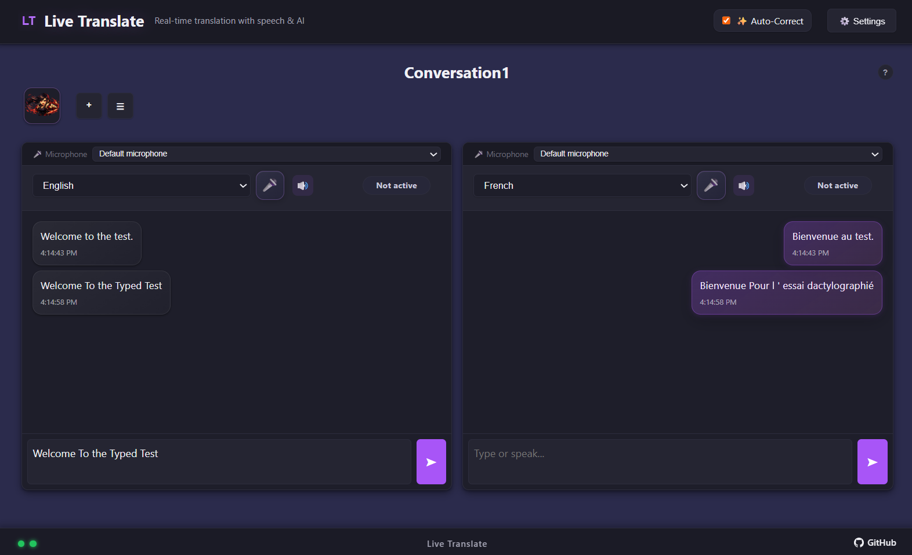

# Live Translate

This project started because the online alternatives that were claimed to be very good and helpful, also cost a lot. This is an attempt at making a free version.

A self-hosted real-time translation web application with speech-to-text, virtual keyboards, and dual-panel conversation mode. Supports LibreTranslate (offline) and 10+ LLM providers as long as you bring your own Key (BYOK). The key can be set at the user or server level.



## Features

- **Text Translation** – Default uses LibreTranslate Framework to Translate between 37+ languages with auto-detection
- **Dual Engine** – LibreTranslate (Argos, self-hosted, offline) + Optional LLM providers (OpenAI, Anthropic, Gemini, Ollama, LM Studio, DeepSeek, Cohere, Groq, Grok, Mistral, Perplexity)
- **Live Conversation Mode** – Dual-panel real-time translation with per-panel language and microphone selection
- **Speech-to-Text** – Web Speech API (browser-native) + optional Whisper (server-side via faster-whisper) + optional AI provider STT (for supported providers/models)
- **Virtual Keyboards** – On-screen keyboard
- **Custom Glossaries** – Create term glossaries for consistent translations
- **Session Management** – Auto-save conversation history with export
- **Session Identicons** – Deterministic session icon with optional per-session image upload
- **Docker Deployment** – Single `docker compose up`

## Quick Start

### DockerHub Run

```bash
docker run -d --name live-translate -p 9015:9015 \
    -v live-translate-data:/data \
    -e LIBRETRANSLATE_LOCAL_ENABLED=true \
    -e LIBRETRANSLATE_LOCAL_URL=http://127.0.0.1:5001 \
    -e SESSION_ICON_DIR=/tmp/session-icons \
    jonesckevin/live-translate:latest
```

### Build

```bash
git clone https://github.com/jonesckevin/live-translate.git
cd live-translate

# Copy the example environment file and configure your settings
cp .env.example .env

# Start the application
docker compose up -d --build
```

The Dockerfile accepts `PYTHON_BASE` (default `python:3.11-slim`).

During image build, Whisper models `tiny`, `base`, `small`, `medium`, and `large-v3` are pre-downloaded into an internal seed cache, then copied into `/data/whisper-model` on first container start. This avoids runtime re-downloads and persists models across restarts/rebuilds via `./data/whisper-model`.

Embedded LibreTranslate language package downloads are also persisted by mounting `./data/cache/libretranslate-local` to `/root/.local`, so Argos language models are reused across container rebuilds/restarts.

Open **http://localhost:9015** in your browser.

## Environment Variables

All environment variables are configured in the `.env` file. Copy `.env.example` to `.env` and configure as needed.

| Variable | Default | Description |
|---|---|---|
| `LIBRETRANSLATE_LOCAL_ENABLED` | `true` | Run embedded LibreTranslate inside live-translate container |
| `LIBRETRANSLATE_LOCAL_URL` | `http://127.0.0.1:5001` | Local LibreTranslate endpoint used when local mode is enabled |
| `LIBRETRANSLATE_SERVER_URL` | `http://libretranslate:5000` | External/sidecar LibreTranslate endpoint used when local mode is disabled |
| `WHISPER_ENABLED` | `false` | Enable server-side Whisper STT |
| `WHISPER_MODEL` | `base` | Whisper model size (tiny/base/small/medium/large) |
| `WHISPER_USE_GPU` | `false` | Enable GPU acceleration for Whisper (requires CUDA) |
| `WHISPER_MODEL_DIR` | `/data/whisper-model` | Whisper model download/cache directory (mounted to `./data/whisper-model`) |
| `STARTUP_FAIL_ON_CHECKS` | `false` | Exit container startup if critical pre-flight checks fail |
| `ALLOW_CLIENT_API_KEYS` | `true` | Allow browser-stored API keys |
| `LOG_DIR` | `/data/logs` | Log file directory |
| `SESSION_ICON_DIR` | `/tmp/session-icons` | Directory for uploaded session icons |
| `OPENAI_API_KEY` | — | OpenAI API key |
| `ANTHROPIC_API_KEY` | — | Anthropic API key |
| `GEMINI_API_KEY` | — | Gemini API key |
| `DEEPSEEK_API_KEY` | — | DeepSeek API key |
| `COHERE_API_KEY` | — | Cohere API key |
| `GROQ_API_KEY` | — | Groq API key |
| `GROK_API_KEY` | — | Grok (X.AI) API key |
| `MISTRAL_API_KEY` | — | Mistral AI API key |
| `PERPLEXITY_API_KEY` | — | Perplexity API key |
| `OLLAMA_HOST` | `http://host.docker.internal:11434` | Ollama server URL |
| `LMSTUDIO_HOST` | `http://host.docker.internal:1234` | LM Studio server URL |
